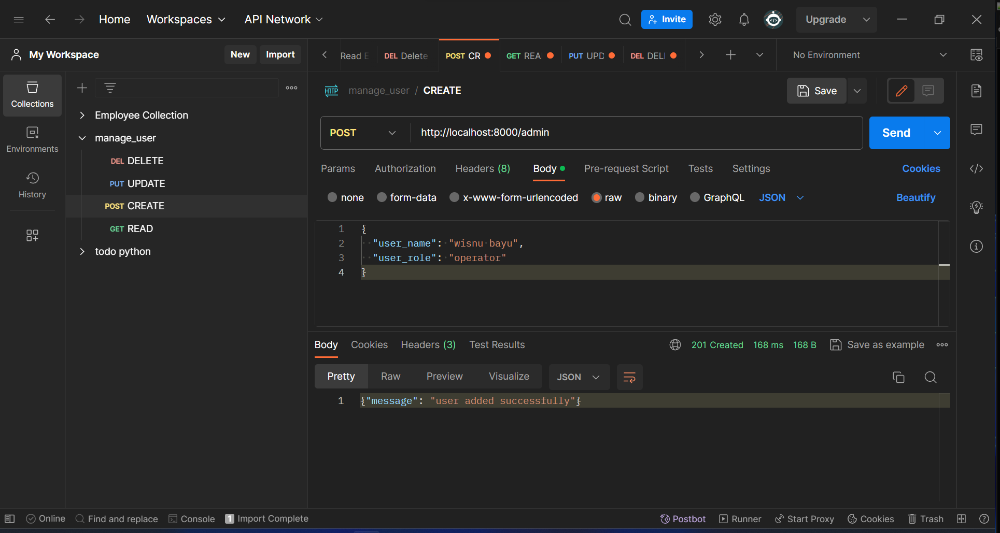
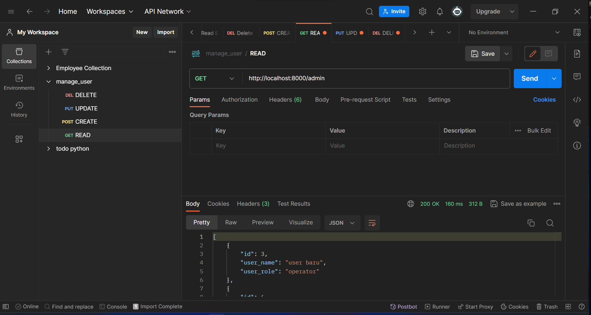
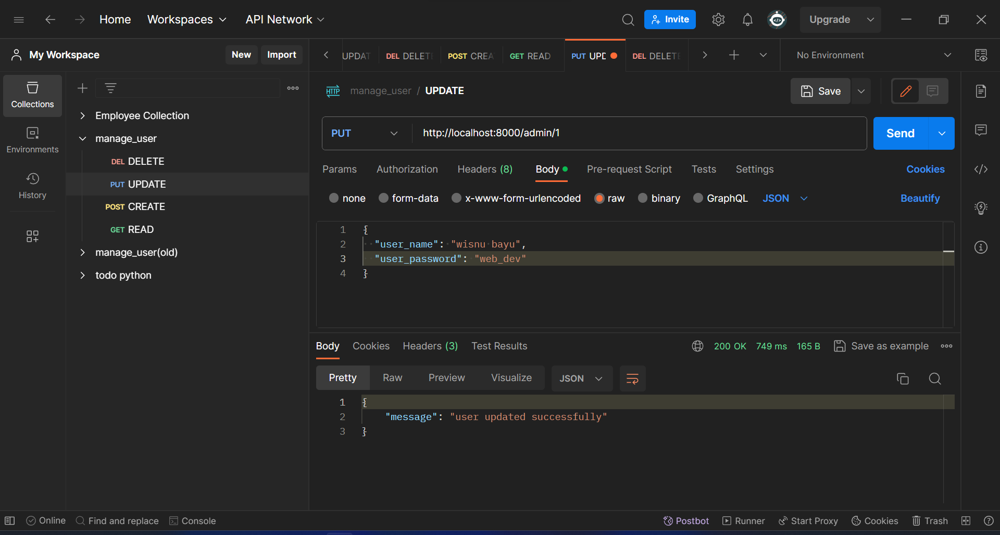

# UTS Microservice CRUD API PLSQL UNSIA

## Requirement

-   Sudah terinstal python dan postgresql
-   Jalankan command `pip install psycopg2 dotenv`

## Cara menjalankan program todo API

1. Download code
2. Jalankan pgAdmin dan buat database bernama `todo`
3. Pada database todo buka psql tool dan input command `CREATE EXTENSION pgcrypto;` untuk install ekstensi pgcrypto
4. Pada database todo buka query tool dan masukan `tasks_encrypt.sql` untuk membuat table task dan membuat fungsi encrypt_tasks untuk fitur enkripsi aes256
5. Buka `.env.example` lalu sesuaikan code didalamnya. Setelah itu rename file menjadi `.env`
6. Nyalakan server dengan command `python main.py`
7. Jalankan program todo API menggunakan postman atau software sejenis. Untuk mempermudah bisa import `collection_todo.json` pada postman

## Contoh Menjalankan Menggunakan Postman

-   Create
    

-   Read
    

-   Update
    

-   Delete
    

## Pengaplikasian Enkripsi AES256

### Perbandingan Select Data

-   Jika tidak memasukan password
    

-   Jika memasukan password
    
