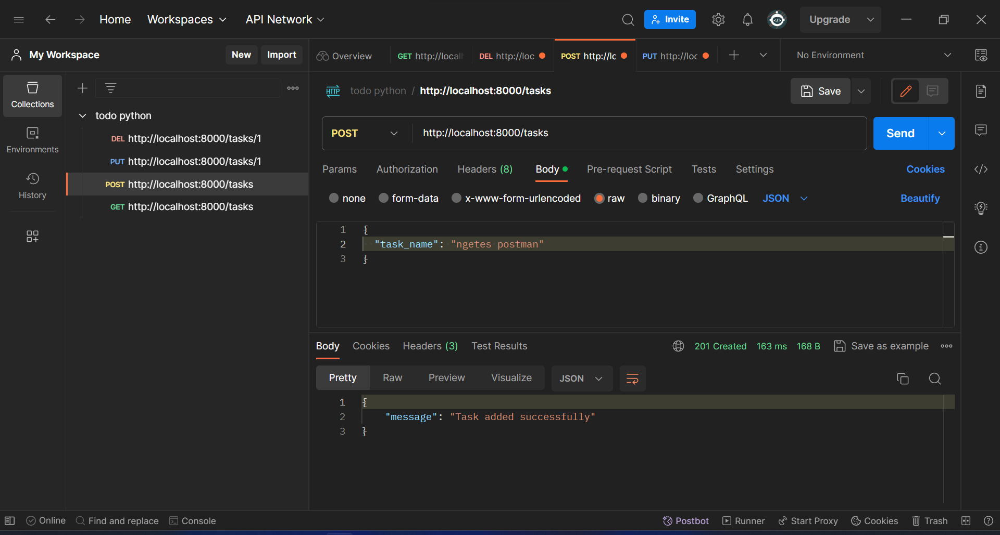
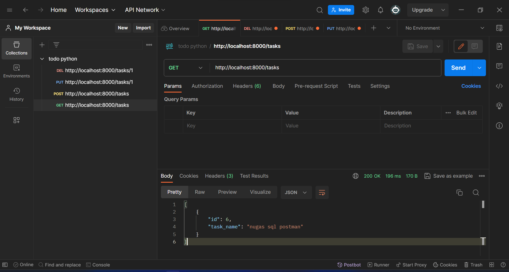
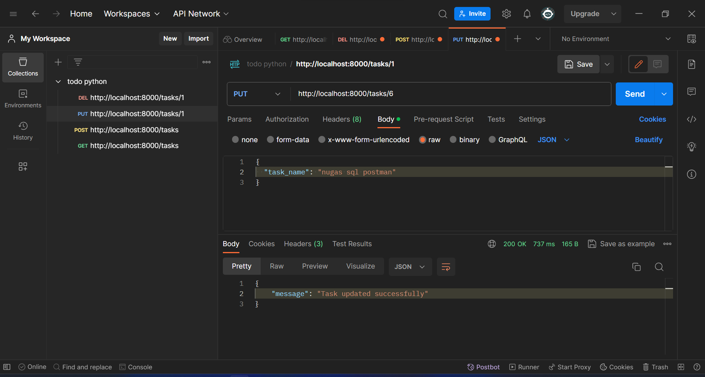
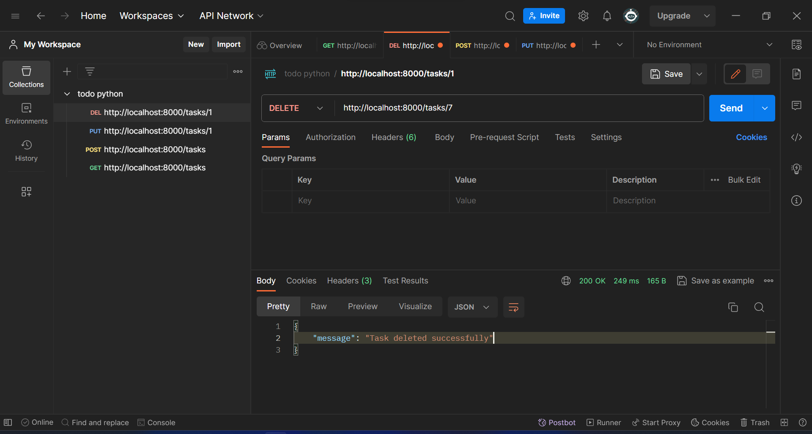

# UTS Microservice CRUD API PLSQL UNSIA

## Requirement

-   Sudah terinstal python dan postgresql
-   Jalankan command `pip install psycopg2 dotenv`

## Cara menjalankan program

1. Download code
2. Jalankan pgAdmin dan buat database bernama todo
3. Pada database todo buka query tool dan masukan `query.sql` untuk membuat table task
4. Jalankan program dengan command `python main.py`
5. Test program menggunakan postman atau software sejenis. Untuk mengetes bisa import `collection_todo.json`

-   Create
    

-   Read
    

-   Update
    

-   Delete
    
