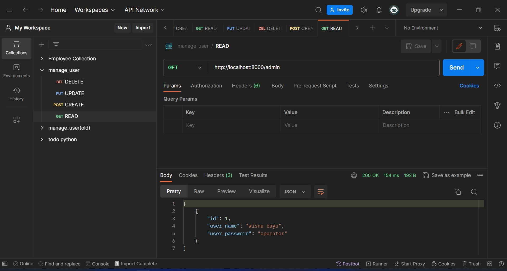

# UTS Microservice CRUD API PLSQL UNSIA

Mata Kuliah : Pemrograman PL/SQL

Kelas : IT302

Prodi : PJJ Informatika

Dosen : Abdul Azzam Ajhari, S.Kom., M.Kom

Anggota Kelompok :

-   Wisnu Bayu Aji Fajar Nugroho (220401010079)
-   Yummiarna (220401020018)
-   Yohanes Almandaru Tommy Prihatin (220401010110)

## Requirement

1. Sudah terinstal python dan postgresql
2. Download code
3. Jalankan command `pip install psycopg2` dan `pip install python-dotenv`
4. Jalankan pgAdmin dan buat database bernama `users`
5. Pada database users buka psql tool dan input command `CREATE EXTENSION pgcrypto;` untuk install ekstensi pgcrypto
6. Pada database users buka query tool dan masukan `user_encrypt.sql` untuk membuat table data_user dan membuat fungsi encrypt_data untuk fitur enkripsi aes256
7. Buka `.env.example` lalu sesuaikan code didalamnya. Setelah itu rename file menjadi `.env`. File ini berisikan kredensial login user manager api dan database

## Cara menjalankan program user manager API

1. Nyalakan server dengan command `python main.py`
2. Jalankan program users manager API menggunakan postman atau software sejenis. Untuk mempermudah bisa import `collection_manage_user.json` pada postman

## Contoh Menjalankan Program Menggunakan Postman

-   Create

    

-   Read

    

-   Update

    

-   Delete

    

## Contoh Pengaplikasian Enkripsi AES256

-   Jika tidak memasukan password

    

-   Jika memasukan password

    
